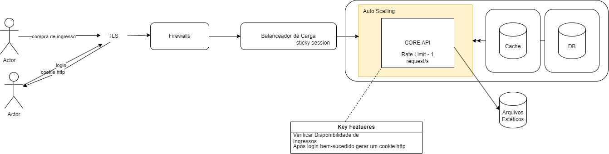

# Arquitetura Big Data Corp

Neste cenário temos um desafio, garantir que o site finalize a venda apenas para pessoas que realmente receberão os ingressos afinal, não queremos que alguém compre o ingresso e depois descubra que não há mais disponiveis. Além disso, precisamos lidar com a questão da velocidade da internet, para que os usuários com conexões mais lentas não sejam prejudicados.

Para resolver estas questões sugeria a seguinte arquitetura:

Balanceador de Carga - ele distribui as solicitações dos usuários entre os vários servidores da aplicação, possibilitando maior capacidade de acessos simultaneos

Escalar de Forma Horizontal -  usária um srviço para escalar de forma horizontal os servidores da aplicação como o ASG (Auto Scalling Group) da AWS se estivermos a falar de uma arquitetura na nuvem

Banco de Dados - um banco de dados que armazene informações sobre ingressos, usuários e sessões ativas e para evitar problemas com ingresso, usamos transações de banco de dados para atualizar o status dos ingressos

Banco de Dados para Cache com o redis

Gerenciamento de sessões -  após o login, o servidor cria uma sessão para o usuário

Para garantir que a velociade de internet não seja um problema podemos limitar o número de requisições por usuário num determinando periodo

